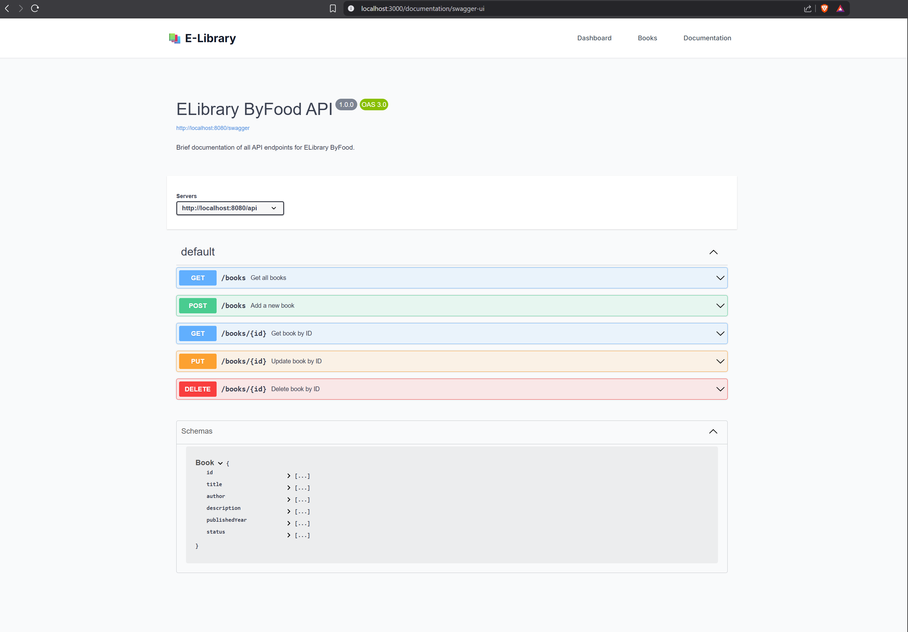

## 🚀 Technical Analysis & Requirements

   
<b>Technical Analysis & Requirements</b>

    
   

      Welcome to <strong>ELibrary ByFood</strong>! This project is a full-stack web application for managing and exploring a digital library. It is built with Go (backend) and Next.js (frontend).
   

   <h4>Requirements</h4>
   <ul>
      <li><strong>Go (Golang)</strong> – for backend API</li>
      <li><strong>Node.js</strong> – for frontend and automation scripts</li>
   </ul>

## 🛠️ How to Run the Project

   
<b>How to Run the Project</b>

    
   

      <strong>Quick Start:</strong> Use the automated scripts for a hassle-free setup, or follow the manual steps for more control.
   

   <h4>Automated Installation & Run (Recommended)</h4>
   <ol>
      <li>Install Node.js dependencies: <code>npm install</code></li>
      <li>Install dependencies for both backend and frontend: <code>npm run install:all</code></li>
      <li>Start both servers: <code>npm run dev</code></li>
   </ol>
   <h4>Manual Setup</h4>
   <strong>Backend (Go)</strong>
   <ol>
      <li>Navigate to backend: <code>cd backend</code></li>
      <li>Run the backend server: <code>go run main.go</code></li>
   </ol>
   <strong>Frontend (Next.js)</strong>
   <ol>
      <li>Navigate to frontend: <code>cd frontend</code></li>
      <li>Install dependencies: <code>npm install</code></li>
      <li>Run the frontend server: <code>npm run dev</code></li>
   </ol>
   

      <em>Note: Make sure both servers are running for full functionality.</em>
   

---

## 📸 Documentation & Screenshots

   
<b>Documentation & Screenshots</b>

    
   

      Explore the main features and UI of ELibrary ByFood through these screenshots. Each image highlights a key part of the user experience or development process.
   

   

      
<b>Dashboard</b>

       
      
      
The dashboard gives you a quick overview of your library, including stats and navigation links.

      
You can also search for books here.

   

   

      
<b>Your Books Page</b>

       
      
      
See all the books you own, filter by status, and manage your collection easily.

   

   

      
<b>Add New Book</b>

       
      
      
Add a new book to your library with a simple form. Required fields are validated for accuracy.

   

   

      
<b>View Book</b>

       
      
      
View detailed information about any book, including author, year, and status.

   

   

      
<b>Filter & Search</b>

       
      
      
Quickly find books using filters for title, author, year, and status.

   

   

      
<b>API Documentation Page</b>

       
      
      
Access Document page to have a complete overview on technical side.

      
You can also navigate to swagger UI from here. 

   

   

      
<b>Swagger UI</b>

       
      
      
Swagger UI lets you explore and test the backend API visually.

   

   

      
<b>How to Run Unit Tests & Backend Tests</b>

       
      

         <strong>Backend (Go):</strong> Run automated tests to ensure your backend logic is working as expected.
      

      <ol>
         <li>Navigate to backend: <code>cd backend</code></li>
         <li>Run all tests: <code>go test -v ./tests</code></li>
         <li>Run a specific test file: <code>go test -v ./tests/file_name.go</code></li>
      </ol>
      

         <em>Test output will show which tests passed or failed. For frontend testing, add your preferred framework.</em>
      

       
      
      
Example of a successful backend test for book-related functionality.

      
      
Example of a successful backend test for URL processing.

   

## Additional Notes & Tips

   
<b>Additional Notes & Tips</b>

    
   <ul>
      <li><b>About the Project:</b> ELibrary ByFood is a full-stack web application for managing, searching, and documenting your book collection. It features a Go backend and a Next.js frontend, with a modern UI and robust API.</li>
      <li><b>Accessing Swagger API Docs:</b> After starting both backend and frontend servers, open your browser and go to <code>http://localhost:3000/documentation</code> to view and interact with the Swagger UI.</li>
      <li><b>Troubleshooting:</b> If you encounter issues, check the terminal for error messages and logs. Most problems can be resolved by reviewing the output and ensuring all dependencies are installed.</li>
      <li><b>Need Help?</b> For further help, consult the code comments, review the documentation, or reach out to me.</li>
   </ul>

   
<b>Git History (On Request)</b>

    
   
On request git history from development attached to the read.me

   

